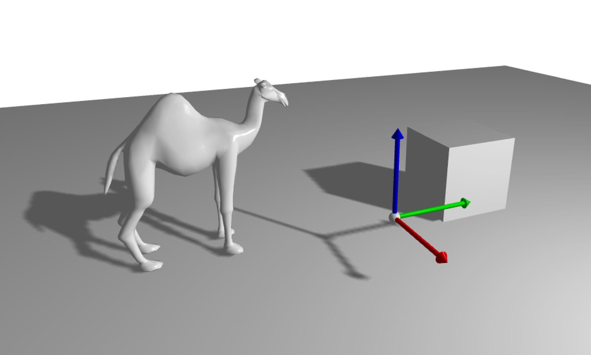

# Shadow Mapping

This code gives an example of implementation of a shadow mapping using a light view with orthographic projection

* In a first pass, all objects emiting shadow are displayed (from the light position, and the depth map is stored)
* In a second pass, all objects are displayed normally. The ones receiving shadows can use the depth map rendered previously.

More details can be found in this [Shadow Mapping Tutorial](https://learnopengl.com/Advanced-Lighting/Shadows/Shadow-Mapping).

